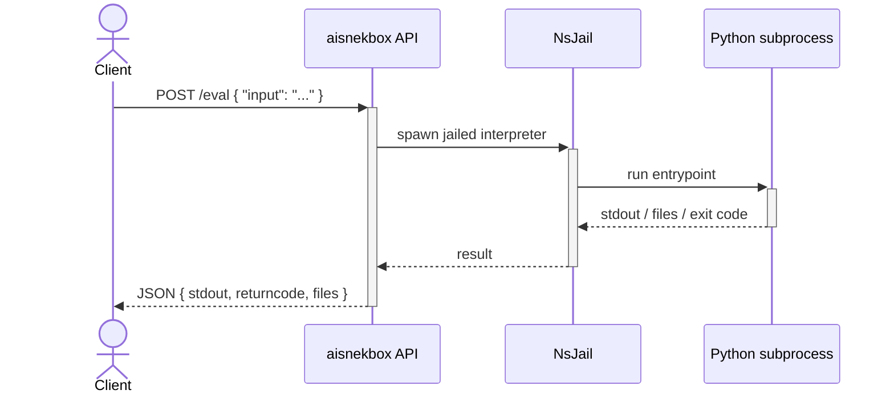

# aisnekbox

A secure REST sandbox for executing **untrusted Python code** in isolation.

`aisnekbox` accepts Python source over HTTP, runs it inside an
[NsJail](https://github.com/google/nsjail) jail with no network access, strict
resource limits and a read-only system filesystem, then returns the captured
output (and any files the code produced) as JSON.

> This is an independent, from-scratch implementation written for an
> experiment. It was designed against the *documented behaviour* of similar
> sandboxes — it does not reuse their source code.



## How it works

For every request the API:

1. validates the payload (size limits, relative paths only, allowlisted
   interpreter);
2. creates a fresh, empty working directory and writes the submitted code to an
   entrypoint script plus any uploaded files;
3. bind-mounts that directory **read-write** as `/home` inside an NsJail jail
   and runs `<interpreter> <entrypoint> [args...]`;
4. captures combined stdout/stderr (truncated to a configurable size) and reads
   back files created or modified during the run;
5. deletes the working directory.

The untrusted code never executes in the API process.

### Security properties

The jail (see [`config/nsjail.cfg`](config/nsjail.cfg)) provides:

- **No networking** — a fresh, empty network namespace.
- **Process isolation** — separate PID, IPC, UTS, mount, cgroup and user
  namespaces.
- **No privilege escalation** — all capabilities dropped, `no_new_privs` set,
  `nosuid`/`nodev` mounts.
- **Read-only system** — `/usr`, `/bin`, `/lib`, … are bind-mounted read-only;
  only the per-run work dir is writable.
- **Resource limits** — CPU time, address space, file size, open files and
  process count rlimits, plus a supervisor-enforced wall-clock timeout and
  output-size cap (defence in depth).

Because NsJail relies on Linux user namespaces and mount operations, the
container runs `--privileged` (as is standard for NsJail-based sandboxes).

## API

### `POST /eval`

Request body:

| Field             | Type                 | Default        | Description                                            |
| ----------------- | -------------------- | -------------- | ------------------------------------------------------ |
| `input`           | string (required)    | —              | Python source executed as the entrypoint.              |
| `args`            | string[]             | `[]`           | Extra arguments passed to the interpreter.             |
| `files`           | FilePayload[]        | `[]`           | Files written into the work dir before execution.      |
| `executable_path` | string \| null       | server default | Interpreter to use; must be in the server allowlist.   |

`FilePayload`: `{ "path": "relative/path", "content": "...", "encoding": "utf-8" | "base64" }`

Response body:

```json
{
  "stdout": "combined stdout and stderr",
  "returncode": 0,
  "files": [
    { "path": "out.txt", "size": 8, "content": "<base64>", "encoding": "base64" }
  ]
}
```

`returncode` is `null` when the process was killed (e.g. it hit the timeout).

Example:

```bash
curl -s http://localhost:8060/eval \
  -H 'Content-Type: application/json' \
  -d '{"input": "print(sum(range(10)))"}'
# {"stdout":"45\n","returncode":0,"files":[]}
```

Interactive OpenAPI docs are available at `/docs` when the server is running.

### `GET /health`

Liveness probe returning `{"status": "ok", "version": "..."}`.

## Running

### Docker (recommended)

NsJail needs kernel features that are only reliably available inside the
provided image:

```bash
docker build -t aisnekbox .
docker run --rm --ipc=none --privileged -p 8060:8060 aisnekbox
```

Or with Compose:

```bash
docker compose up --build
```

### Local development

```bash
python -m venv .venv && source .venv/bin/activate
pip install -e ".[dev,server]"

# Run the test-suite (uses a fake NsJail, so no privileges needed):
pytest

# Lint & type-check:
ruff check .
mypy aisnekbox

# Run the API (requires a real `nsjail` on PATH to actually evaluate code):
python -m aisnekbox
```

## Configuration

All settings have defaults and are overridable via `AISNEKBOX_`-prefixed
environment variables (see [`aisnekbox/config.py`](aisnekbox/config.py)):

| Variable                       | Default          | Description                              |
| ------------------------------ | ---------------- | ---------------------------------------- |
| `AISNEKBOX_HOST`               | `0.0.0.0`        | Bind address.                            |
| `AISNEKBOX_PORT`               | `8060`           | Listen port.                             |
| `AISNEKBOX_CPU_TIME`           | `10`             | CPU-time limit (s) inside the jail.      |
| `AISNEKBOX_WALL_TIME`          | `20`             | Wall-clock timeout (s).                  |
| `AISNEKBOX_MEMORY_LIMIT_MB`    | `128`            | Address-space limit (MiB).               |
| `AISNEKBOX_MAX_PROCESSES`      | `1`              | Max processes/threads.                   |
| `AISNEKBOX_MAX_OUTPUT_SIZE`    | `1000000`        | Max captured output (bytes).             |
| `AISNEKBOX_MEMFS_SIZE_MB`      | `32`             | Work dir / file-size budget (MiB).       |
| `AISNEKBOX_ALLOWED_EXECUTABLES`| python3 paths    | Comma-separated interpreter allowlist.   |
| `AISNEKBOX_DEBUG`              | `false`          | Verbose logging.                         |

## License

[MIT](LICENSE)
